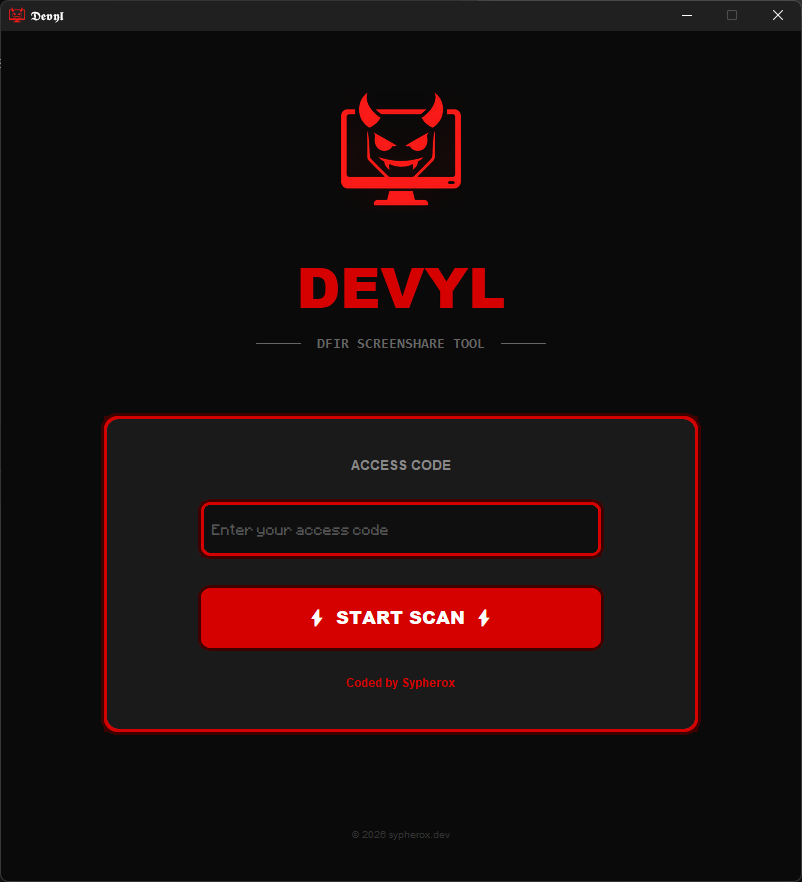
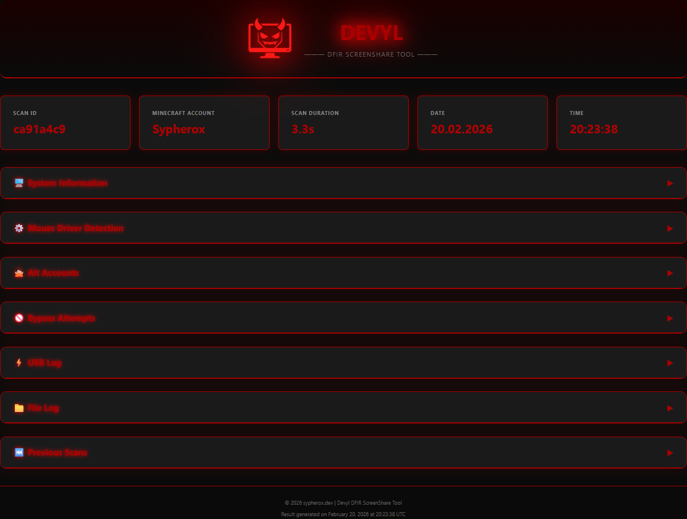
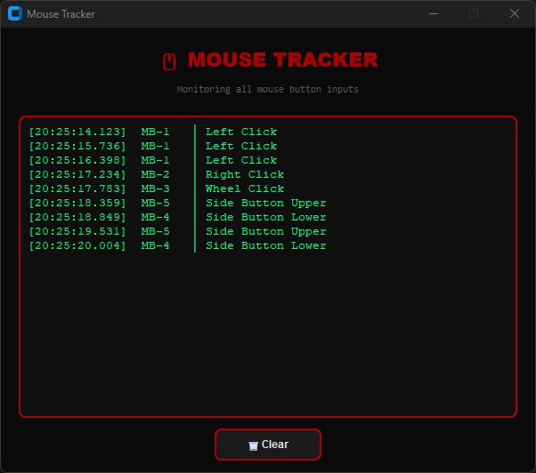
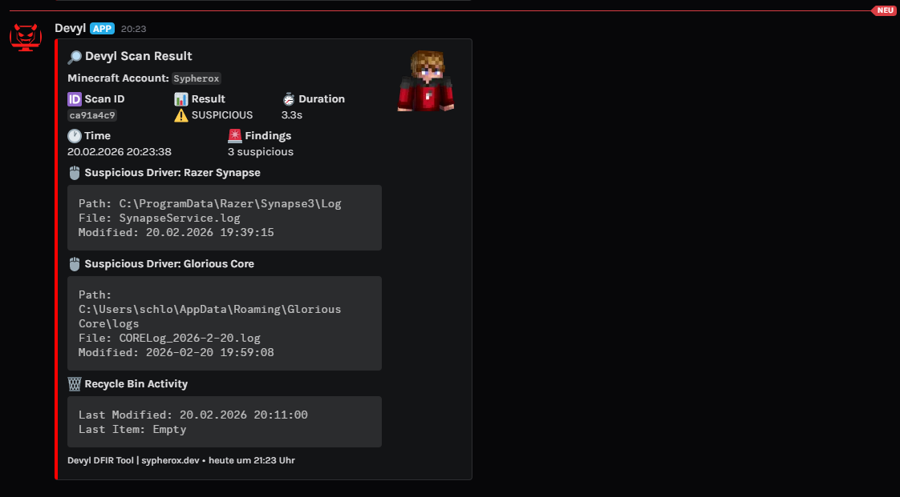

<div align="center">
  
  
  # DEVYL
  ### DFIR Screenshare Tool
  
  
  
  
  
</div>

---

## 📖 Overview

**Devyl** is a Windows-based **Digital Forensics & Incident Response (DFIR)** tool built for Minecraft screenshare investigations. It performs automated evidence collection, artifact analysis and behavioral forensics on a target system, generating a detailed HTML report and Discord webhook notification within seconds.

Designed to be deployed as a standalone `.exe`, Devyl requires no installation and runs with a simple access code authentication.

---

## 🔬 What Devyl Does

### 🖱️ Mouse Driver Forensics
Devyl scans all installed mouse driver software directories (Razer Synapse, Logitech G HUB, SteelSeries GG, etc.) for recently modified configuration files. It checks **last write timestamps** against a suspicion threshold, files modified within the last 12 hours are flagged. It also parses driver config files for **macro activity signatures**, detecting patterns indicative of automated input sequences.

### 🔐 Anti-Forensics & Bypass Detection
Devyl queries multiple Windows forensic artifacts to detect evidence of tampering:

- **USN Journal** (`fsutil usn readjournal`) ⇌ detects if the NTFS change journal was cleared, which is a strong indicator of evidence destruction
- **Windows Event Logs** ⇌ checks for specific Event ID's
- **Prefetch Analysis** ⇌ inspects `C:\Windows\Prefetch\` for hidden files, read-only attributes and duplicate entries which may indicate prefetch manipulation
- **UserAssist Registry** (`HKCU\Software\Microsoft\Windows\CurrentVersion\Explorer\UserAssist`) ⇌ detects if execution tracking has been disabled or cleared
- **Recycle Bin Metadata** ⇌ checks `$Recycle.Bin` last modification timestamps for recent deletions
- **Renamed Executables** ⇌ scans drives for non-`.exe` files containing the PE header signature `This program cannot be run in DOS mode`, identifying disguised binaries
- **PowerShell ConsoleHost History** ⇌ checks `PSReadline\ConsoleHost_history.txt` for modification timestamps and file attributes

### ⚙️ Service Integrity Checks
Monitors critical Windows services known to help bypassers:
- `SysMain` (Prefetch engine)
- `EventLog` (Windows Event Log)
- `Bam` (Background Activity Moderator)
- `DPS` (Diagnostic Policy Service)
- `PcaSvc` (Program Compatibility Assistant)

Stopped or disabled services are cross-referenced against known bypass tool behavior.

### 📁 File Execution Log
Combines two data sources:
- **Prefetch files** (`*.pf`) modified within the last 6 hours ⇌ reveals recently executed programs
- **USN Journal RENAME records** ⇌ detects file rename operations which may indicate obfuscation attempts

### ⚡ USB & Device Log
Parses `Microsoft-Windows-Kernel-PnP/Configuration` Event ID `410` to enumerate all recently connected USB and hardware devices.

### 👤 Minecraft Account Detection
Scans multiple account storage locations (launcher profiles, credential caches, registry) to enumerate all associated Minecraft accounts, distinguishing the main account from alt accounts, with direct links to NameMC, Laby.net and PvPRivals Website.

Additonally scans Minecraft log files across all known launcher directories (.minecraft, Lunar Client, LabyMod, CheatBreaker, Prism, MultiMC, etc.) for `Setting user:` entries to detect accounts not stored in launcher profiles.

### 💀 Doomsday Client Detection
Scans for known Doomsday Client artifacts including installation directories, config files and registry entries.

### 🔏 Unsigned Executable Detection
Scans common directories for unsigned executables matching known cheat client signatures.

---

## 📸 Screenshots

### Scan Interface


### HTML Report


### Mouse Tracker


### Discord Webhook


---

## 🚀 Usage

1. Run `Devyl.exe` as Administrator
2. Enter an access code
3. Wait for the scan to complete (~30–60 seconds)
4. HTML report opens automatically in your browser

---

## ⚙️ Configuration

Copy `config.example.py` to `config.py` and fill in:

```python
ACCESS_CODE = "your-secret-code"
DISCORD_WEBHOOK_URL = "https://discord.com/api/webhooks/..."
```

---

## 🛠️ Build from Source

```bash
pip install -r requirements.txt
pyinstaller devyl.spec --clean
```

---

<div align="center">
  <sub>Built with ❤️ by <a href="https://sypherox.dev">Sypherox</a> · © 2026 sypherox.dev</sub>
</div>
